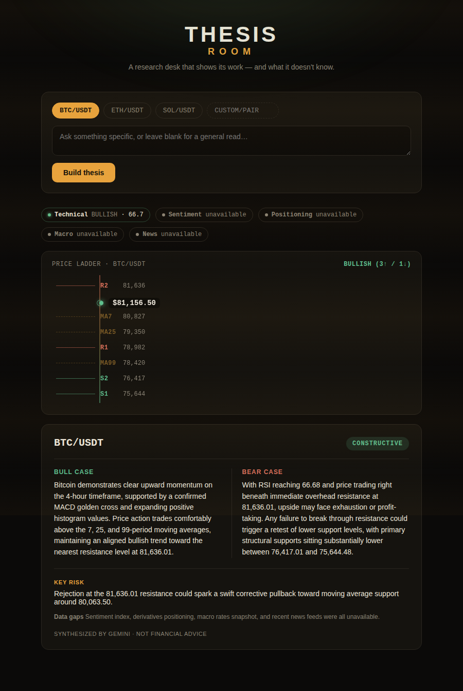
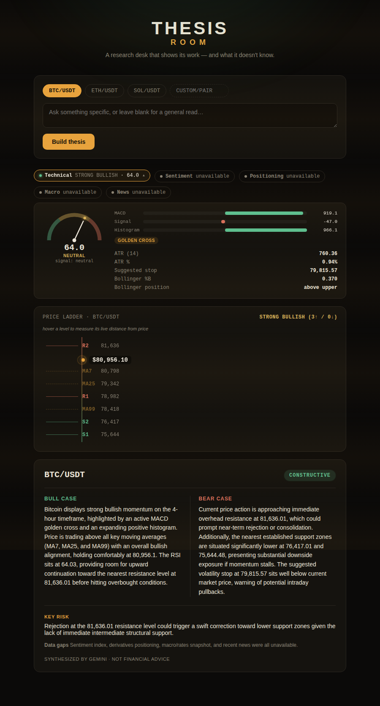
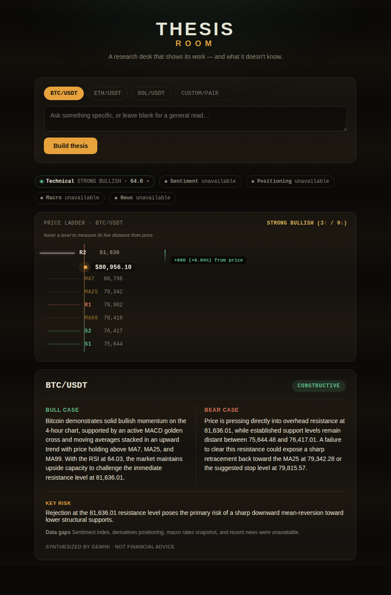

# Thesis Room

A personalized natural-language market research workbench, built for the **Bitget AI Base Camp Hackathon S2** (AI Trading Desk track).

Thesis Room pulls live market signals through Bitget's public `bitget-signal` MCP server (technical indicators, sentiment, derivatives positioning, macro rates, news), then uses an LLM to synthesize a structured bull/bear thesis card — bull case, bear case, key risk, and a plain-language verdict. No fake confidence scores: if a signal is unavailable, the UI says so instead of hiding the gap.



## What makes it different

- **Every visual is wired to real data, not decoration.** The price ladder plots live support/resistance and moving averages to scale; hovering a level draws a beam to the current price and counts up the exact live $ and % distance. The current-price marker's pulse speed is driven by the real ATR (volatility) reading. The RSI gauge's needle angle is recomputed every frame directly from the live value.
- **Honest about gaps.** Signal chips show which data sources are live vs. unavailable rather than papering over a flaky public feed.
- **No invented confidence numbers.** The LLM is instructed to give a plain verdict (constructive / cautious / mixed / avoid) — never a fabricated percentage.




## Architecture

- **backend/** — Express API (`/api/thesis`, `/api/signals`) that connects to Bitget's public MCP server, gathers five signal types in parallel, and synthesizes a thesis via a pluggable LLM provider (Gemini free tier by default, or Anthropic / Bitget's Qwen subsidy). Includes a resilience layer (retry + timeout + success/failure caching) since the shared public data feed is unreliable under hackathon-week load.
- **frontend/** — React + Vite UI with framer-motion animation: signal strip, price ladder, thesis card, all driven by the same live payload.

## Running locally

### Backend

```bash
cd backend
npm install
cp .env.example .env   # add your own GEMINI_API_KEY (free, instant, no card — aistudio.google.com/app/apikey)
node src/server.js
```

### Frontend

```bash
cd frontend
npm install
npm run dev
```

The frontend expects the backend at `http://localhost:4000` by default (override with `VITE_API_URL`).

## Not financial advice

Thesis Room is a research aid, not a trading signal. It shows its work and its gaps — the verdict is a starting point for your own thinking, not a recommendation.
